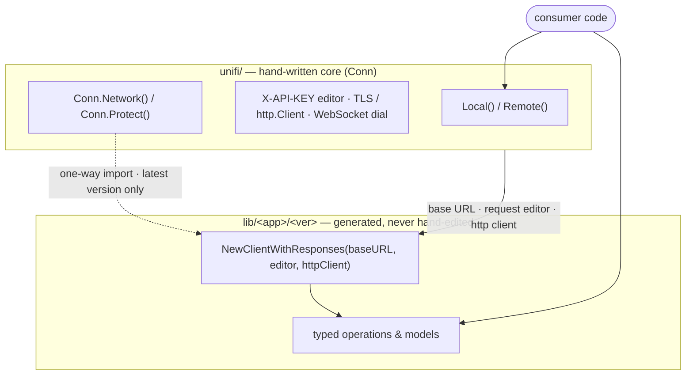
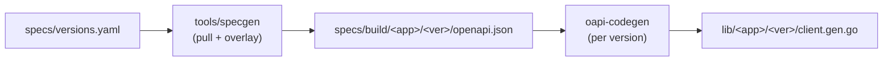

# Architecture — UniFi

This document describes how the SDK is structured and how data flows through it. It implements the
[functional requirements](../requirements/functional-requirements.md) and reflects the
[decision records](decisions/index.md).

## Overview

The SDK has two clearly separated halves:

1. **Generated clients** (`lib/<app>/<appversion>`) — produced by `oapi-codegen` from augmented
   OpenAPI specs. Purely machine-owned, never hand-edited, and with **no dependency on the rest of
   the SDK**. Multiple application versions coexist side-by-side.
2. **Hand-written core** (`unifi/`) — owns connection, authentication, transport, TLS, errors, and the
   version-agnostic WebSocket layer. It depends one-way on the **latest** generated version to offer
   convenience accessors.

## Package layout

| Path | Ownership | Purpose |
|---|---|---|
| `unifi/` | hand-written | `Conn`, `Local`/`Remote`, transport, TLS, errors, WebSocket, latest-version convenience |
| `lib/network/<ver>/` | generated | Network client + models for a pinned app version |
| `lib/protect/<ver>/` | generated | Protect client + models (incl. event/message types) for a pinned app version |
| `specs/` | mixed | `versions.yaml` pins, `overlays/`, committed `build/` specs, gitignored `.cache/` |
| `tools/specgen/` | hand-written | pulls upstream from the mirror and applies overlays |
| `examples/`, `e2e/` | hand-written | runnable samples and Ginkgo e2e suite |

Package names encode the app version with underscores (valid Go identifiers), e.g.
`lib/network/v10_3_58` → `package networkv10_3_58`.

### Why coexisting versioned packages

UniFi consoles run different firmware. Keeping each pinned application version as its own importable
package lets a consumer target the exact API surface their console exposes, and lets the SDK add new
versions additively without breaking older imports. The newest pinned version is the default surfaced
by the root convenience methods. See
[ADR-0004](decisions/0004-coexisting-versioned-lib-packages.md).

## Connection & transport

`unifi.Local(host, apiKey, opts...)` and `unifi.Remote(consoleID, apiKey, opts...)` both build a
`*unifi.Conn`. The `Conn` computes the correct base URL per app and exposes the primitives the
generated constructors require:

- `NetworkBaseURL()` / `ProtectBaseURL()` — full `…/integration` prefix for local or remote.
- `RequestEditor()` — an `oapi-codegen` `RequestEditorFn` that sets `X-API-KEY`.
- `HTTPClient()` — the configured `*http.Client` (timeouts, TLS).

A generated client for **any** coexisting version is built by passing these primitives into that
version's generated `NewClientWithResponses`. The root's `Conn.Network()` / `Conn.Protect()` do
exactly this for the latest version, returning the generated `*ClientWithResponses` directly so
callers use generated types (no wrapper layer — see
[ADR-0006](decisions/0006-generated-client-only.md)).

There is **no import cycle**: `lib` never imports `unifi`; `unifi` imports only the latest `lib`
version.

## Error handling

Generated `…WithResponses` methods return typed responses exposing each documented status. The root
package adds `unifi.APIError` carrying operation name, HTTP status, and the decoded API error envelope,
plus helpers to classify common cases (auth failure, not found, rate limit).

## Real-time (WebSocket)

Protect exposes `/v1/subscribe/devices` and `/v1/subscribe/events`. OpenAPI cannot model these, so the
SDK ships a hand-written, **version-agnostic** WebSocket layer in `unifi/websocket.go`
(`coder/websocket`):

- `Conn.Subscribe(ctx, app, path)` dials `wss://…` reusing the same auth header and TLS config, and returns
  a stream of raw frames plus lifecycle/error signaling.
- `unifi.Decode[T](frame)` unmarshals a frame into the caller's chosen `lib` version event/device type.

A single implementation serves all coexisting versions because only the typed payload differs, and
those types come from the generated package the caller selects. See
[ADR-0005](decisions/0005-hand-written-websocket-client.md).

## Generation pipeline

`just sync` runs `specgen`; `just gen` runs `oapi-codegen` and `go generate` (which also drives
counterfeiter fakes). CI's drift guard re-runs both and fails on any diff. See
[spec-augmentation](spec-augmentation.md).

## Testing architecture

- **Unit:** Ginkgo + Gomega specs per package. `counterfeiter` fakes the HTTP doer / request seams so
  transport, auth, TLS, error mapping, and WebSocket decoding are tested without real network; golden
  fixtures cover response decoding.
- **E2E:** a build-tagged (`e2e`) Ginkgo suite under `e2e/` runs against `httptest` mock servers, and
  optionally a real console when credentials are provided via env (otherwise skipped).

## Dependencies

- Runtime: std `net/http`; `coder/websocket` (realtime); `oapi-codegen` runtime helpers.
- Tooling: `oapi-codegen`, `counterfeiter`, `ginkgo`, `golangci-lint`, `git-cliff`, `goreleaser`,
  `just`, `gomarkdoc`, `mkdocs-material`, `kin-openapi` (spec validation in `specgen`).
