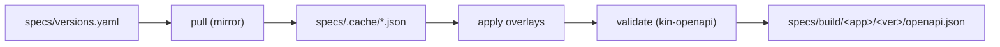

# Spec Augmentation — UniFi SDK

## Problem

The official UniFi OpenAPI documents (served by `developer.ui.com`, mirrored daily by
[`opastorello/unifi-api-docs`](https://github.com/opastorello/unifi-api-docs)) are **not directly
generatable**:

- `components.securitySchemes` is **empty** — there is no declared `X-API-KEY` auth.
- `servers` is only the relative `/integration`, with no notion of local vs remote.
- The **Protect** spec has **no `tags`** and `info.version: 0.0.0`, so generated operations would not
  group into meaningful sets and the version is meaningless.

We therefore transform upstream into an SDK-ready spec deterministically.

## Approach: pull + overlay (not vendored)

We do **not** commit raw upstream JSON. Instead `tools/specgen` (invoked by `just sync` and in CI):

1. Reads `specs/versions.yaml` — the source of truth for pinned versions:
   ```yaml
   network:
     default: v10.3.58
     versions: [v10.3.58]
   protect:
     default: v7.1.46
     versions: [v7.1.46]
   retain: all          # coexisting versions are kept; pruning is an explicit decision
   ```
2. Downloads each pinned upstream spec from the mirror into `specs/.cache/` (gitignored).
3. Applies the [OpenAPI Overlay](https://spec.openapis.org/overlay/v1.0.0.html) documents in
   `specs/overlays/`.
4. Validates the result with `kin-openapi` and writes it to
   `specs/build/<app>/<appversion>/openapi.json` (committed; consumed by codegen and the docs viewer).



## Overlays

| File | Responsibility |
|---|---|
| `common.overlay.yaml` | Add `securitySchemes.ApiKeyAuth` (`type: apiKey, in: header, name: X-API-KEY`); set global `security`; define parameterized local + remote `servers` with `variables` (`host`, `consoleId`). |
| `network.overlay.yaml` | Network-specific server defaults; pin `info.version` to the app version. |
| `protect.overlay.yaml` | **Synthesize tags** from path segments (e.g. `/v1/cameras/*` → `Cameras`, `/v1/viewers/*` → `Viewers`); pin `info.version`. |

Overlays are the **only** place corrections are made — `lib/` is never hand-edited. If upstream adds
an endpoint that needs special handling, the fix is an overlay action, keeping regeneration
deterministic.

### Server augmentation

The injected `servers` express both transports so the generated base URL and docs viewer are correct:

```yaml
servers:
  - url: "https://{host}/proxy/{app}/integration"
    description: Local console
    variables:
      host: { default: "unifi.local" }
      app:  { enum: [network, protect], default: network }
  - url: "https://api.ui.com/v1/connector/consoles/{consoleId}/{app}/integration"
    description: Remote cloud connector
    variables:
      consoleId: { default: "" }
      app:       { enum: [network, protect], default: network }
```

At runtime the root `unifi.Conn` constructs the concrete base URL; the server block primarily drives
documentation and validation.

## Determinism & drift

- Same `versions.yaml` + overlays ⇒ byte-identical `specs/build/**`.
- CI re-runs `just sync && just gen` and fails if committed specs or `lib/**` differ (drift guard).
- The scheduled `spec-sync` workflow opens a PR when the mirror changes for a pinned version, and a
  separate PR that **appends** a newly available version to `versions.yaml` and moves `default`.

## Protect `v7.1.83`

The requested Protect `v7.1.83` is newer than the mirror's latest and is not cleanly extractable from
the `developer.ui.com` SPA. We pin `v7.1.46` now; when the mirror publishes `v7.1.83` the version-bump
PR adds it as a coexisting package and promotes it to `default`. See
[ADR-0007](decisions/0007-protect-version-pin.md).
